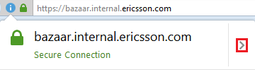
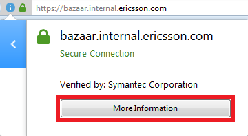
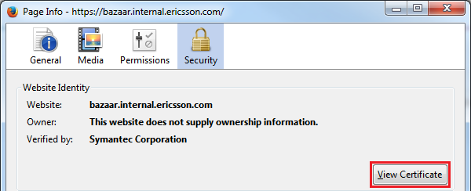
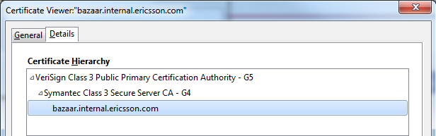

# About Merchant

## Prerequisites

[Ericsson Bazaar][bazaar] is working over HTTPS, so in order for web scraping to work, the Bazaar SSL certificate must be imported in the Java key store.

### Exporting SSL certificate from Bazaar web-site

The following steps assume that you are using Mozilla Firefox web browser.

1. Open the [Ericsson Bazaar][bazaar] web-site

1. Click on the lock icon in the address bar:

    

1. Click on the right-arrow (`>`) icon:

    

1. Click on the "More Information" button:

    

1. Click on the "View Certificate" button:

    

1. Open the Details tab and select "bazaar.internal.ericsson.com" entry in the "Certificate Hierarchy" panel

    

1. Click "Export" button and save SSL certificate as "bazaar.internal.ericsson.com.crt"

### Importing SSL certificate into the Java key store

Run `import_certificate.bat` and make sure that `bazaar.internal.ericsson.com.jks` gets generated

## See also

[How to connect via HTTPS using Jsoup?][jsoup-https]

[bazaar]:           https://bazaar.internal.ericsson.com/
[jsoup-https]:      http://stackoverflow.com/a/7745706